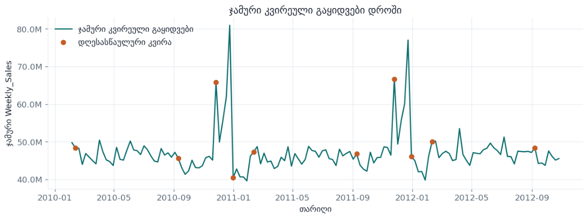
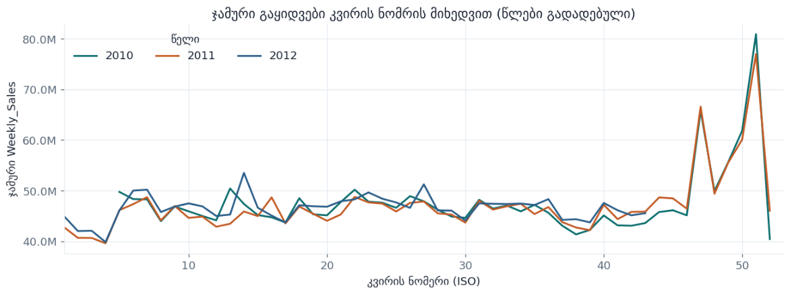
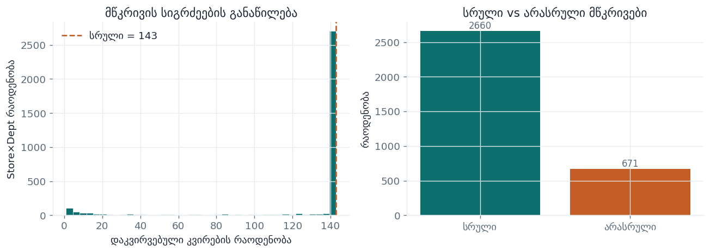
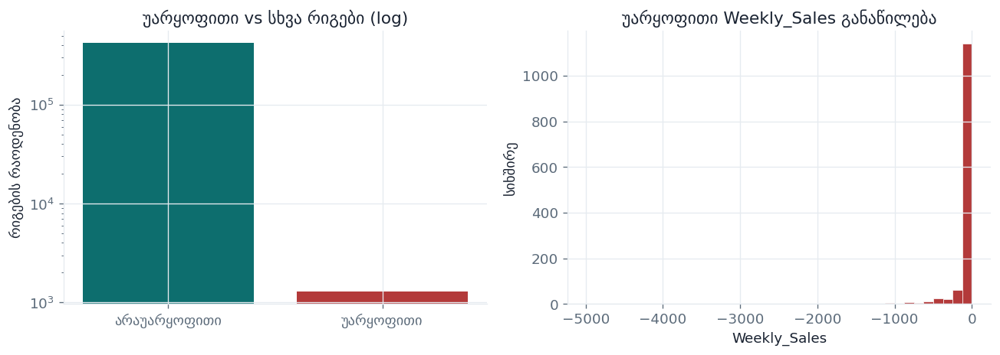
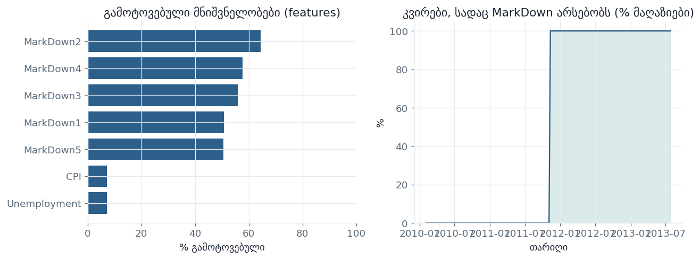
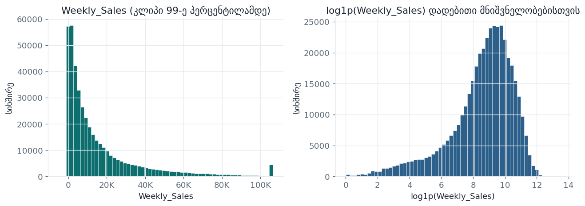
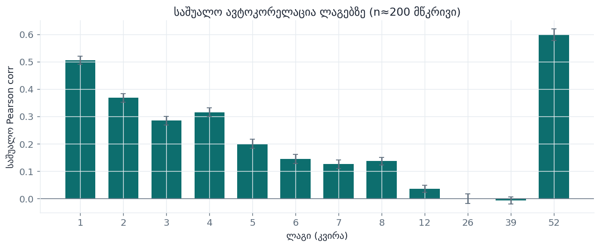
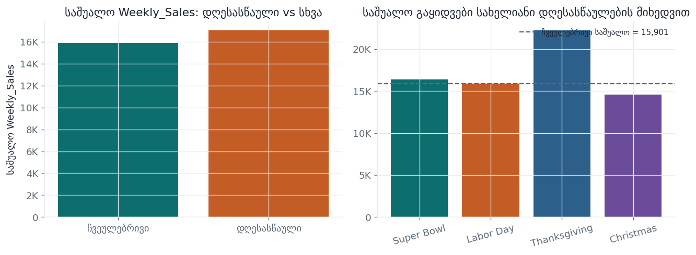
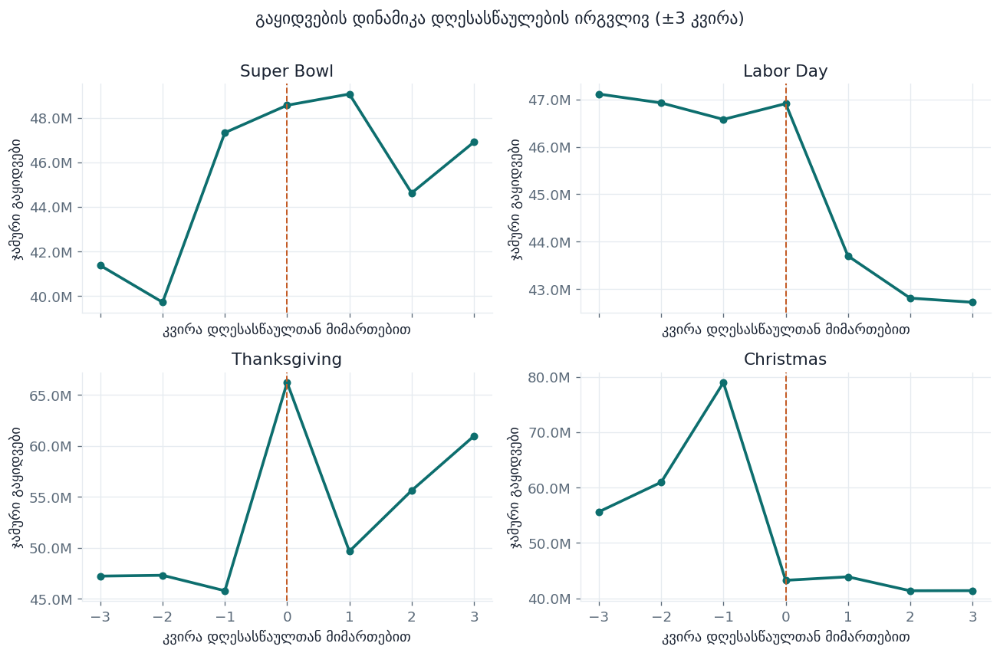
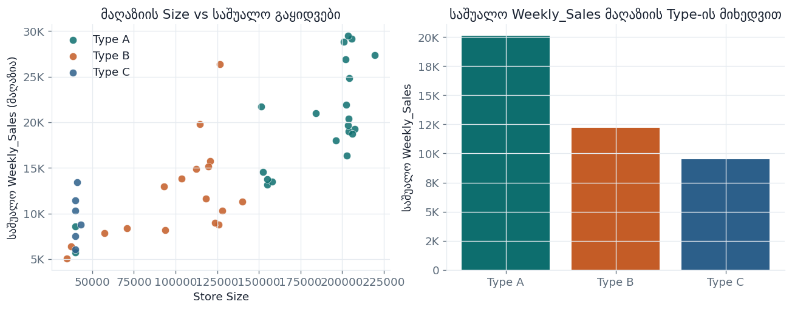

# Walmart Recruiting — Store Sales Forecasting

[Walmart Recruiting - Store Sales Forecasting](https://www.kaggle.com/competitions/walmart-recruiting-store-sales-forecasting)
Kaggle-ს კონკურსი.

## პრობლემის აღწერა

ამ პროექტში ჩვენი მიზანია **ვოლმარტის 45 მაღაზიაში** თითოეული **დეპარტამენტის კვირის გაყიდვების** პროგნოზირება ისტორიული მონაცემების საფუძველზე.

გვაქვს ათასობით დამოუკიდებელი `(Store, Dept)` მწკრივი. პროგნოზები ფასდება მეტრიკით, რომელიც არის **Weighted Mean Absolute Error (WMAE)**:

```
WMAE = Σ(w_i · |y_i − ŷ_i|) / Σ(w_i)

w_i = 5 თუ კვირა დღესასწაულს შეიცავს, ნორმალურ შემთხვევაში 1.
ანუ დღესასწაულზე შეცდომა 5-ჯერ უფრო ძვირი გვიჯდება.
```

დღესასწაულური კვირები (Super Bowl, Thanksgiving, Christmas) ამიტომ დომინირებენ ლიდერბორდის მეტრიკაში.

### გამოწვევები

- **სეზონური რყევები.** გაყიდვები მნიშვნელოვნად იცვლება საცალო კალენდართან ერთად - განსაკუთრებით Thanksgiving, Christmas და მათ გარშემო კვირებში.
- **აქციების / MarkDown-ების გავლენა.** დროებითი ფასდაკლებები დეპარტამენტებზე არათანაბრად მოქმედებს; რომელი მწკრივები რეაგირებენ და რამდენად - წინასწარ რთული დასადგენია.
- **დღესასწაულების წონითი სიმძიმე.** ოთხ ძირითად დღესასწაულურ კვირაში შეცდომა **5-ჯერ** უფრო ძვირია, ვიდრე ჩვეულებრივ კვირაში.
- **შეზღუდული დღესასწაულური ისტორია.** თითოეული დღესასწაული წელიწადში მხოლოდ ერთხელ მოდის, ამიტომ სეზონური შაბლონებისთვის დადებითი მაგალითები ცოტაა.

### მიზანი

მოდელების დატრენინგება, რომლებიც საუკეთესოდ შეძლებს მომავლის პროგნოზს, იქნება ეს ჩვეულებრივი დღე თუ რაიმე სახის დღესასწაული.

---

## რეპოზიტორის სტრუქტურა

```
walmart-recruiting-store-sales-forecasting/
├── README.md
├── EDA.ipynb                    # EDA + გრაფიკები (eda_figures/)
├── eda_figures/                 # README-ს სურათები
├── model-inference-final.ipynb  # ფინალური ინფერენსი (XGBoost v4)
├── preprocessing.ipynb
├── features.ipynb
│
├── # ხის / კლასიკური მოდელები
├── experiment-xgboost-v4.ipynb
├── experiment_light_v4.ipynb
├── experiment-RandomForest.ipynb
├── experiment-arima-v2.ipynb
├── experiment-SARIMA.ipynb
├── experiment-Prophet.ipynb
├── experiment-NeuralProphet.ipynb
│
├── # ნეირონული პროგნოზირების მოდელები
├── experiment-DLinear.ipynb
├── experiment-NBEATS.ipynb
├── experiment_tft_v3.ipynb
└── experiment_patchtst_v1.ipynb
```

---


ძველი, სამუშაო ნოუთბუქები (`experiment-xgboost.ipynb`, `experiment-lightgbm-v2/v3`, `experiment-arima.ipynb`, `experiment-tft.ipynb`, …) შენახულია ისტორიისთვის; ქვემოთ აღწერილია **მიმდინარე ვერსიები**.

კონკურსის მონაცემებს სიდიდის გამო (`train.csv`, `test.csv`, `features.csv`, `stores.csv`, `sampleSubmission.csv`) ვტვირთავთ Kaggle / Colab secrets-იდან და რეპოზიტორიაში არ გვაქვს შენახული.

---

## MLflow / WandB ბმულები

| სერვისი | ბმული / პროექტი |
|---|---|
| **GitHub** | https://github.com/lshek22/walmart-recruiting-store-sales-forecasting |
| **DagsHub + MLflow** | https://dagshub.com/lshek22/walmart-recruiting-store-sales-forecasting |
| **WandB პროექტი** | `ml-final-projekt-walmart-sales-forecasting` (TFT / PatchTST login; უმეტესი ნოუთბუქი მხოლოდ MLflow-ით ლოგავს) |

ყველა ექსპერიმენტის პარამეტრებს, WMAE მეტრიკებს და არტეფაქტებს **MLflow-ით DagsHub-ზე** ვლოგავთ  (`repo_owner=lshek22`).

---

## EDA — მონაცემების ანალიზი

სრული ექსპლორაცია არის ნოუთბუქში [`EDA.ipynb`](EDA.ipynb). გრაფიკები ინახება `eda_figures/` ფოლდერში (Kaggle-ზე **Save & Run All** → გადმოწერეთ `eda_figures/` და ჩააგდეთ რეპოზიტორში).

### წლიური სეზონურობა

ჯამური კვირეული გაყიდვები დროში — ნათლად ჩანს საშობაო პიკები და დღესასწაულური კვირები.



იგივე მონაცემი **კვირის ნომრის** მიხედვით, წლები ერთმანეთზე გადადებული — სეზონური შაბლონი უფრო ადვილად შესადარებელია.



### არასრული მწკრივები

ბევრი `(Store, Dept)` წყვილი სრული კვირების კალენდარს არ ფარავს — მოკლე ან ხარვეზებიანი მწკრივები მოდელირებას ართულებს.



### უარყოფითი გაყიდვები

უარყოფითი `Weekly_Sales` იშვიათია (დაბრუნებები / კორექციები); პრეპროცესინგში ჩვეულებრივ **0-მდე** იკვეცება.



### MarkDown და გამოტოვებული მნიშვნელობები

`MarkDown1–5` ხშირად ცარიელია — აქციები ყველა კვირაში არ არის. CPI / Unemployment-საც აქვს ხარვეზები.



### Weekly_Sales განაწილება

გაყიდვები მკვეთრად მარჯვნივ გადახრილია; `log1p` ტრანსფორმაცია უფრო სიმეტრიულ სურათს იძლევა.



### ავტოკორელაცია ლაგებზე

მოკლე ლაგები და წლიური ლაგი (`52`) ძლიერად კორელირებს — ამიტომ ხის მოდელებში და AR-ტიპის არქიტექტურებში ლაგები მნიშვნელოვანია.



### დღესასწაულების ეფექტი

დღესასწაულურ კვირებში საშუალო გაყიდვები უფრო მაღალია; Thanksgiving და Christmas განსაკუთრებით გამოირჩევა.



### დღესასწაულების ირგვლივ გაყიდვების დინამიკა

±3 კვირა თითოეული დღესასწაულის გარშემო — მაგ. Christmas-მდე ზრდა და შემდეგ ვარდნა.



### Store Size / Type vs Sales

უფრო დიდი მაღაზიები და განსხვავებული `Type`-ები განსხვავებულ საშუალო გაყიდვებს აჩვენებენ.




---

## Train / Val / Test დაყოფა

**ტესტ სეტი** ყოველთვის ოფიციალური Kaggle `test.csv` ჰორიზონტია (კვირის პარასკევები `train.csv`-ის დასრულების შემდეგ). მოდელები Kaggle-ის ტესტ ლეიბლებზე არ ტრენინგდება.

ვალიდაცია ოჯახების მიხედვით განსხვავდება:

### A. დღესასწაულზე ორიენტირებული 3-ფოლდიანი rolling origin
იყენებენ **DLinear, N-BEATS, Prophet, SARIMA, NeuralProphet, XGBoost**.

| ფოლდი | ვალიდაციის ფანჯარა |
|---|---|
| **holiday** | 2011-11-01 → 2012-01-31 |
| **spring** | 2012-02-01 → 2012-04-30 |
| **late** | 2012-08-01 → 2012-10-31 |

ტრენინგი იყენებს მთელ ისტორიას **თითოეული ფოლდის დაწყებამდე**. მოდელის შერჩევა მინიმიზაციას უკეთებს **სამივე ფოლდის საშუალო WMAE**-ს, ამიტომ Christmas / Thanksgiving კვირები ვალიდაციაში ყოველთვის არის წარმოდგენილი.

### B. ერთჯერადი walk-forward holdout-ები (ხის / NeuralForecast ნოუთბუქები)

| მოდელი | ვალიდაციის ფანჯარა |
|---|---|
| **XGBoost v4** | 2011-10-01 → 2012-01-15, და 3-fold |
| **LightGBM v4** | 2011-10-01 → 2012-01-15 |
| **TFT v3 / PatchTST v1** | თარიღები ≥ 2011-10-01 |
| **ARIMA v2** | ტრენის ბოლო **8 კვირა** (≈ 2012-09-07 → 2012-10-26) |

### C. TimeSeriesSplit (Random Forest)

**Random Forest** იყენებს `TimeSeriesSplit(n_splits=4)`-ს უნიკალურ კვირებზე (არა Holiday/Spring/Late კალენდარულ ფოლდებს).

---

## Feature Engineering

ფიჩერების სტრატეგია მოდელის კლასზეა დამოკიდებული:

### საერთო პრეპროცესინგი (უმეტეს ნოუთბუქში)
- `Weekly_Sales`-ის კლიპი **≥ 0**
- MarkDown NaN-ების შევსება **0**-ით
- `stores.csv` + `features.csv` გაერთიანება Store / Date-ზე
- დღესასწაულის წონა **5** WMAE-სთვის და (სადაც მხარდაჭერილია) sample weight-ებისთვის

### მდიდარი ცხრილური FE (XGBoost, LightGBM, Random Forest)
- მაღაზიის მეტამონაცემები: `Type`, `Size`
- ამინდი / ეკონომიკა: Temperature, Fuel_Price, CPI, Unemployment
- კალენდარი: წელი / თვე / კვირა წელში, sin/cos კოდირება, გასული კვირები
- დღესასწაულის ფლაგები და მანძილები (ნიშნიანი მანძილი; days-to / days-post თითოეულ დღესასწაულამდე)
- ლაგები (`1, 2, 4, 8, 52`, …), rolling mean/std, YoY თანაფარდობები
- გაფართოებადი target encoding-ები `shift(1)`-ით (leakage-safe)
- MarkDown აგრეგატები და ინტერაქციები (დღესასწაული × MarkDown, Unemployment × MarkDown)
- ხის importance pruning საბოლოო ფიტამდე

### კლასიკური / ადიტიური დროითი მწკრივების FE
- **ARIMA:** მხოლოდ ოპციონალური ეგზოგენური `IsHoliday`
- **SARIMA / Prophet / NeuralProphet:** Walmart-ის დღესასწაულების ცხრილი — `super_bowl`, `labor_day`, `thanksgiving`, `christmas`, **`pre_christmas`**
- ხარვეზების დამუშავება: მწკრივის შიგნით კვირის ბადე (interior fill / ინტერპოლაცია); Prophet `y ≥ 1`-ზე აწევს მულტიპლიკატიური სეზონურობისთვის

### ღრმა პროგნოზირების FE
- **DLinear / N-BEATS / PatchTST:** ძირითადად **უნივარიატული** Store×Dept გაყიდვები `log1p` + სერიის Min–Max-ის შემდეგ (DLinear/N-BEATS) ან NeuralForecast სკალირებით
- **TFT:** სრული კოვარიატების მიბმა — **მომავალი** (კალენდარი, დღესასწაულები, ამინდი, MarkDown-ები), **ისტორიული** (`PrevYearSales`), **სტატიკური** (Store, Dept, Type, Size)

---

## მოდელები

### XGBoost ტრენინგი

**ნოუთბუქი:** `experiment-xgboost-v4.ipynb`

გლობალური `XGBRegressor` მდიდარ ცხრილურ ფიჩერებზე.

- **Objective:** `reg:absoluteerror` დღესასწაულის sample weight-ებით `{5, 1}`
- **HPO:** Optuna (~15 ტრაალი) — `learning_rate`, `max_depth`, `min_child_weight`, `subsample`, `colsample_bytree`
- **ინფერენსი:** რეკურსიული მრავალსაფეხურიანი პროგნოზი Kaggle ტესტ ჰორიზონტზე; შერევა `lag_52`-თან; Christmas კვირის mass-shift პოსტპროცესი
- **თრექინგი:** ეტაპობრივი MLflow ექსპერიმენტები `XGBoost_v4_*`
- **ვალიდაციის WMAE (ნოუთბუქი):** blended ≈ **1688** (`α = 0.75`)

---

### LightGBM ტრენინგი

**ნოუთბუქი:** `experiment_light_v4.ipynb`

იგივე FE / რეკურსიული პროგნოზის რეცეპტი, რაც XGBoost-ს, `LGBMRegressor`-ით.

- **Objective:** `regression_l1` + დღესასწაულის sample weight-ები
- **HPO:** Optuna (~15 ტრაალი) — `learning_rate`, `num_leaves`, `min_child_samples`, `subsample`, `colsample_bytree`
- **პოსტპროცესი:** `lag_52` blend + Christmas shift (იგივე ოჯახი, რაც XGBoost)
- **თრექინგი:** `LightGBM_v4_*` DagsHub-ზე
- **ვალიდაციის WMAE (ნოუთბუქი):** blended ≈ **2387** (`α = 0.30`)

---

### Random Forest ტრენინგი

**ნოუთბუქი:** `experiment-RandomForest.ipynb`

`RandomForestRegressor` leakage-safe v2 FE-ით (IQR კლიპი მხოლოდ ტრენიდან, ნიშნიანი დღესასწაულის მანძილები, გაფართოებადი encoding-ები).

- **ფიტი:** MSE + დღესასწაულის `sample_weight`; შერჩევა CV WMAE-ით
- **ძებნა:** მცირე გრიდი (`max_depth`, `min_samples_leaf`, `max_features`; `n_estimators=300`)
- **ვალიდაცია:** 4-ფოლდიანი `TimeSeriesSplit` კვირებზე
- **თრექინგი:** `RandomForest_*` MLflow ექსპერიმენტები
- **გამოტანა:** `submission_randomforest.csv`

---

### ARIMA ტრენინგი

**ნოუთბუქი:** `experiment-arima-v2.ipynb`

ლოკალური **თითო Store×Dept**-ზე ARIMA / ARIMAX მოდელები (`statsmodels`).

- **დიაგნოსტიკა:** ADF, ACF/PACF, სეზონური დეკომპოზიცია მხოლოდ ტრენზე
- **წესრიგის სკრინი:** მანუალური გრიდი `(0,1,0)…(2,1,2)` ± `IsHoliday` ეგზოგი 50 მწკრივის ქვესიმრავლეზე (≥80 კვირა)
- **ვალიდაცია:** ტრენის ბოლო 8 კვირა
- **Fallback-ები:** ბოლო საშუალო / გლობალური მედიანა მოკლე ან ჩავარდნილი ფიტებისთვის
- **თრექინგი:** `ARIMA_Training_v2`
- **ქვესიმრავლის WMAE:** ჩემპიონი `ARIMA(2,1,2)` ≈ **2408** (ARIMAX+holiday იმავე ქვესიმრავლეზე უარესი იყო)

---

### SARIMA ტრენინგი

**ნოუთბუქი:** `experiment-SARIMA.ipynb`

სეზონური ARIMA პერიოდით **52**, გაზიარებულ **3 დღესასწაულურ ფოლდზე** გადაყვანილი.

- **კანდიდატები:** `(0,1,1)×(0,1,1,52)`, `(1,1,1)×(0,1,1,52)`, `(1,1,1)×(0,1,0,52)`, პლუს SARIMAX `IsHoliday`-ით ან Walmart ივენთების დამიებით
- **შერჩევა:** ფოლდების საშუალო WMAE მწკრივების ქვესიმრავლეზე (`MIN_TRAIN_WEEKS=80`)
- **საბმიშენი:** თითო მწკრივის რეფიტი checkpoint/resume-ით; დეპარტამენტის მედიანის fallback; პროგნოზის კაპი ისტორიული მაქსიმუმის 5×-ზე
- **თრექინგი:** `SARIMA_Training`
- **შიდა ჩემპიონი (DagsHub):** `(0,1,1)×(0,1,1,52)`, საშუალო ფოლდის val WMAE ≈ **2129**

---

### Prophet ტრენინგი

**ნოუთბუქი:** `experiment-Prophet.ipynb`

ლოკალური Prophet მოდელები Walmart-ის დღესასწაულების ცხრილით და Optuna პრიორებით.

- **პრეპროცესი:** მწკრივის შიგნით gap-fill (გლობალური წამყვანი ნულების გარეშე); `y` floor = 1
- **HPO:** Optuna (~20 ტრაალი) — changepoint / seasonality / holiday პრიორები, `n_changepoints`, წლიური Fourier რიგი, ადიტიური vs მულტიპლიკატიური
- **ვალიდაცია:** Holiday / Spring / Late → საშუალო WMAE (ძებნისას მწკრივების ქვესიმრავლე)
- **თრექინგი:** `Prophet_Training` (train და val WMAE თითო ფოლდზე)
- **Kaggle (რეპორტირებული):** public ≈ **2734**, private ≈ **2829** (Prophet v4 საბმიშენი)

---

### NeuralProphet ტრენინგი

**ნოუთბუქი:** `experiment-NeuralProphet.ipynb`

**გლობალური** NeuralProphet (ერთი მოდელი, ბევრი ID) AR-Net-ით.

- **დიზაინი:** `n_lags=52`, წლიური სეზონურობა, ოპციონალური Walmart ივენთების future regressor-ები; `trend_global_local='global'`
- **სკრინი:** მცირე კონფიგების სიმრავლე (`base_ar`, `events`, `events_deep_ar`) holiday ფოლდზე, შემდეგ სამივე ფოლდის ხელახალი შეფასება
- **სტაბილურობა / სიჩქარე:** მუდმივი / მოკლე მწკრივების მოცილება; ისტორიის შემოკლება predict-მდე; chunked პროგნოზი; მწკრივების ლიმიტი Colab გაშვებებისთვის
- **თრექინგი:** `NeuralProphet_Training` (მხოლოდ MLflow; WandB ამოღებულია)

---

### DLinear ტრენინგი

**ნოუთბუქი:** `experiment-DLinear.ipynb`

უნივარიატული DLinear (ტრენდი + სეზონური ხაზოვანი თავები), გლობალურად დატრენინგებული Store×Dept ფანჯრებზე.

- **პრეპროცესი:** კვირის ბადის gap-fill(0) → `log1p` → სერიის Min–Max (ფიტი მხოლოდ ტრენზე)
- **HPO:** Optuna (~30 ტრაალი): `seq_len`, `pred_len`, kernel size, `const_init`, batch size, learning rate
- **ტრენინგი:** L1 loss, Adam, 30 ეპოქა, grad clip 1.0
- **ვალიდაცია:** საშუალო WMAE Holiday / Spring / Late ფოლდებზე
- **თრექინგი:** `DLinear_Training` (MLflow; WandB გრადიენტებისთვის არ გამოიყენება)
- **Kaggle (რეპორტირებული):** public ≈ **2977**, private ≈ **3163** (DLinear v2 საბმიშენი)

---

### N-BEATS ტრენინგი

**ნოუთბუქი:** `experiment-NBEATS.ipynb`

უნივარიატული N-BEATS (MLP backcast/forecast სტეკები) იმავე პრეპროცესითა და ფოლდებით, რაც DLinear-ს.

- **HPO:** Optuna (~25 ტრაალი): stacks, blocks, layers, width, dropout, lookback, horizon, batch, lr
- **ტრენინგი:** L1, AdamW, 25 ეპოქა; ძებნისას **მაქს. 10 ფანჯარა / მწკრივი**
- **თრექინგი:** `NBEATS_Training`
- **Kaggle (რეპორტირებული):** public ≈ **2779**, private ≈ **2879** (N-BEATS v2 საბმიშენი)

---

### TFT ტრენინგი

**ნოუთბუქი:** `experiment_tft_v3.ipynb`

Temporal Fusion Transformer **NeuralForecast**-ით, სწორი მომავალი / ისტორიული / სტატიკური კოვარიატებით.

- **დაყოფა:** ტრენი `< 2011-10-01`, ვალიდაცია მოგვიანებით კვირებზე; საბოლოო ფიტი მთელ ტრენზე; ტესტისთვის `h=60`
- **HPO:** თანმიმდევრული 1-D სვიპები (არა Optuna): `input_size`, `hidden_size`, `n_head`, `batch_size`, `lr`, `dropout` — კოვარიატებით და მათ გარეშე
- **Loss:** ტრენინგში MAE; შერჩევისთვის WMAE
- **თრექინგი:** `TFT_Training` + WandB login (`ml-final-projekt-walmart-sales-forecasting`)
- **შენიშვნა:** კოვარიატები ზოგ კონფიგში ეხმარება, ზოგჯერ კი აუარესებს; მხოლოდ ტარგეტის ბეიზლაინები მნიშვნელოვან რეფერენსად რჩება

---

### PatchTST ტრენინგი

**ნოუთბუქი:** `experiment_patchtst_v1.ipynb`

Patch Time Series Transformer (NeuralForecast), როგორც **უნივარიატული** გლობალური მრავალმწკრივიანი მოდელი.

- **იგივე val თარიღი**, რაც TFT-ს (`≥ 2011-10-01`)
- **HPO:** 1-D სვიპები — `input_size`, `patch_len`, `batch_size`, `lr`, `dropout`; საბოლოო კანდიდატებისთვის უფრო გრძელი `max_steps` გაშვებები
- **თრექინგი:** `PatchTST_Training` / `patchtst_v1` + WandB login
- **ვალიდაციის WMAE (ნოუთბუქი):** საუკეთესო დაბეჭდილი გაშვებები ≈ **2234**-მდე

---

## მეტრიკების შეჯამება

| მოდელი | ტიპური შერჩევის მეტრიკა | შენიშვნა |
|---|---|---|
| XGBoost v4 | Val WMAE ≈ 1688 (blended) | ყველაზე ძლიერი ცხრილური ბეიზლაინი ნოუთბუქში |
| LightGBM v4 | Val WMAE ≈ 2387 (blended) | იგივე რეცეპტი, განსხვავებული val ფანჯარა |
| PatchTST | Val WMAE ≈ 2234 | უნივარიატული ტრანსფორმერი |
| SARIMA | ფოლდების საშუალო WMAE ≈ 2129 | სეზონური ლოკალური მოდელები |
| N-BEATS | Kaggle public ≈ 2779 | გაზიარებული 3-ფოლდიანი რეცეპტი |
| Prophet | Kaggle public ≈ 2734 | დღესასწაულების ცხრილი + Optuna |
| DLinear | Kaggle public ≈ 2977 | გაზიარებული 3-ფოლდიანი რეცეპტი |
| TFT | Val სვიპები ~3140–4500 | მგრძნობიარეა კოვარიატების კონფიგის მიმართ |
| ARIMA | ქვესიმრავლის WMAE ≈ 2408 | არასეზონური ლოკალური ბეიზლაინი |
| Random Forest / NeuralProphet | Runtime CV | იხილეთ DagsHub გაშვებები |

ზუსტი ლიდერბორდის რიცხვები საბმიშენის ვერსიაზეა დამოკიდებული; ყოველთვის უპირატესობა მიეცით DagsHub / Kaggle-ის უახლეს ჩანაწერს მოცემული ნოუთბუქისთვის.

---

## როგორ გავუშვათ

1. მიაბით Kaggle კონკურსის მონაცემები (ან დააყენეთ `KAGGLE_API_TOKEN` Colab-ზე).
2. ოპციონალური საიდუმლოები: `DAGSHUB_USER_TOKEN`, `WANDB_API_KEY` (TFT / PatchTST).
3. გახსენით სასურველი `experiment-*.ipynb`.
4. **GPU** უპირატესია DLinear, N-BEATS, TFT, PatchTST, NeuralProphet-ისთვის; **CPU** საკმარისია Prophet, SARIMA, ARIMA და ხის მოდელებისთვის.
5. სადაც არის, გამოიყენეთ `FAST_RUN` სმოუკ-ტესტისთვის სრული Optuna / სვიპის გაშვებამდე.
6. ატვირთეთ მიღებული `submission_*.csv` Kaggle-ზე.

## Model Inference
mlflow-დან იწერს submission.csv ფაილს და ინახავას kaggle/working/ouput დირექტორიაში

---

